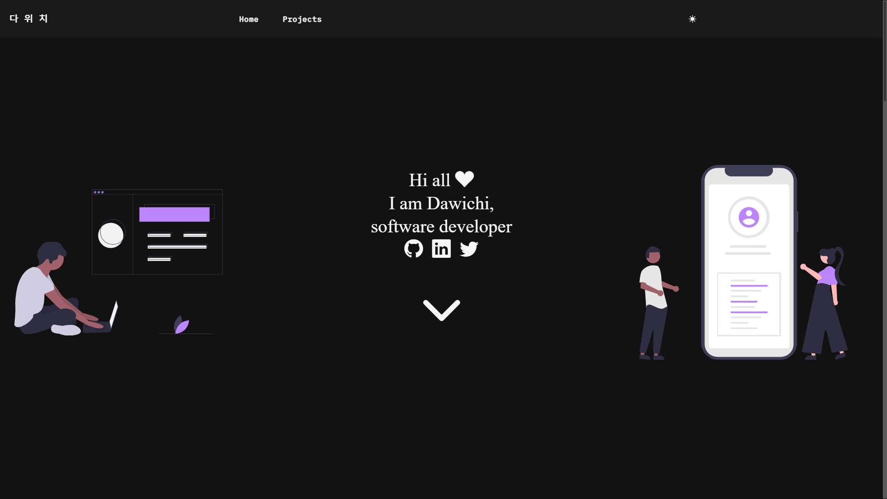

<h1 align="center">dawichi.dev</h1>

    

### My personal website!

After a first version with Gatsby, and after having learned better React and Typescript, I have decided on NEXTjs for my personal website!
